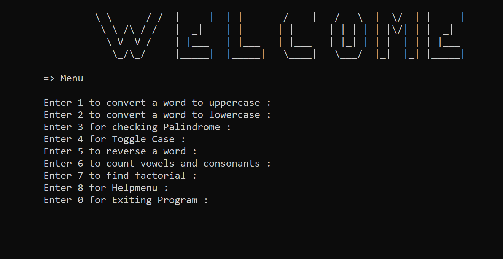
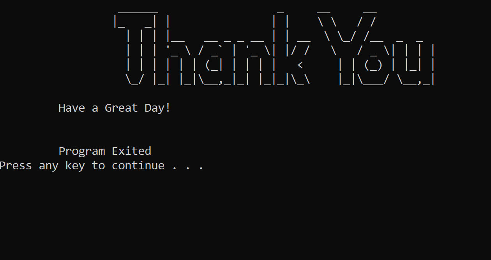

# C++ Semester 2 Project – String & Math Utility Program

This is a console-based interactive C++ program developed during my 2nd semester at **Gomal University, Sub Campus Tank**. It provides users with a variety of basic **string manipulation** and **mathematical operations** through a simple menu-driven interface.

---

## Features

The application supports the following functionalities:

1. Convert a string to **Uppercase**
2. Convert a string to **Lowercase**
3. **Check Palindrome** for a string
4.  **Toggle Case** of each character in a string
5. **Reverse a string**
6.  **Count vowels** and **consonants** in a string
7.  **Calculate factorial** of a number
8. **Display Help Menu**

---
---
## Tech Stack

- Language: **C++**
- IDE: **Dev C++**
-  Platform: **Windows**
- Concepts Used: `Loops`, `Functions`, `Classes`, `Switch Case`, `Strings`, `Conditionals`
---
###  Welcome Screen



### Thank You Screen


---

## How to Run (on Dev C++)
- Open Dev C++

- Go to File → New → Source File

- Paste your entire C++ code

- Save the file as main.cpp

- Press F11 or click Execute → Compile & Run

- The output window will appear with your program's menu.
---
## Project Structure
```
sem2p/
┣  main.cpp
┃   welcome.png
┃  thank.png
┗  README.md
```
##  Notes
- This project uses strupr() and strlwr() (which are not standard C++). You may need to replace these with manual loops or transform() if compiling on Linux.

- The project includes system("cls") and system("PAUSE") which are Windows-specific commands.
---
##  License

This project is open-source and available under the [MIT License](LICENSE).

---

##  About the Author

```cpp
// Written with ❤️ in C++
class Author {
public:
    string name = "Sohaib";
    string university = "Gomal University, Sub Campus Tank";
    string degree = "BS Computer Science";
    int semester = 2;

    void display() {
        cout << "Passionate about learning, coding, and building creative tech projects!" << endl;
    }
};
```
